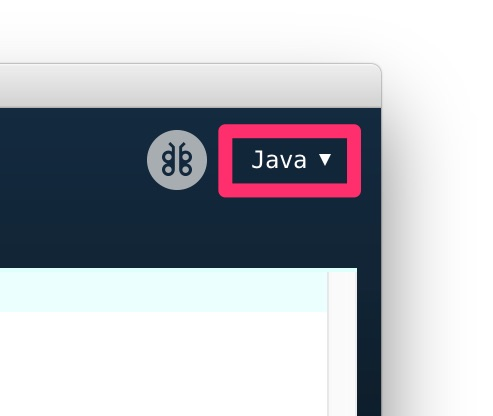

# [DAY 4] 함수 & 프로세싱

## 함수

함수란 수학에서 많이 듣던 단어일 것이다. 그리고 프로그래밍에서도 함수가 있다. 앞에서 본 `print`, `range`등이 함수이다. 프로그래밍의 함수도 수학의 함수와 거의 같지만, 그보다 일종의 요리 기구로 설명할 수 있다. 오븐, 믹서기, 토스트기 등이 특정 요리 행위들을 한번의 명령으로 할 수 있게 하는 것과 같이 함수 또한 특정 행위들을 한번의 명령으로 할 수 있도록 한 것이다.

```python
print('재료를 씻는다.')
print('재료를 손질한다.')
print('양념을 만든다.')
print('조리한다.')
print('마무리한다.')
```

위 코드를 그냥 여러번 반복하게 하려면 똑같은 코드를 반복시켜 붙여넣거나 반복문을 사용해 반복해야할 것이다.

```python
def cook():
  print('재료를 씻는다.')
  print('재료를 손질한다.')
  print('양념을 만든다.')
  print('조리한다.')
  print('마무리한다.')

cook()
```

위와 같이 하면 `cook`이라는 함수를 만들고 그걸 그대로 호출해 편하게 사용할 수 있다.

```python
def cook():
  print('재료를 씻는다.')
  print('재료를 손질한다.')
  print('양념을 만든다.')
  print('조리한다.')
  print('마무리한다.')
  return '짜장면'

food = cook()
print(food)
```

위와 같이 하면 `return` 뒤의 값이 `cook` 함수를 호출한 곳 `cook()`과 바뀌게 된다.

```python
def cook(jjajang, jjambbong, tangsuyuk):
  print('재료를 씻는다.')
  print('재료를 손질한다.')
  print('양념을 만든다.')
  print('조리한다.')
  print('마무리한다.')
  return '짜장면 ' + str(jjajang) + ' 그릇, 짬뽕 ' + str(jjambbong) + ' 그릇, 탕수육 ' + str(tangsuyuk) + '개'

food = cook(1, 2, 1)
print(food)
```

위와 같이 함수에 재료처럼 정보를 전달할 수 있다. 여기서 `str`은 숫자를 글자로 바꿔주는 명령어다.

## 프로세싱

함수까지 배웠기 때문에 이제 프로세싱(Proceesing)이란 걸 해본다. 프로세싱은 일반인이나 예술가가 손 쉽게 그래픽 작품을 만들 수 있게 해주는 프로그램이다. 기본적으로 Java로 프로그래밍을 하지만 Python을 이용해 프로그래밍이 가능하다. [프로세싱 홈페이지](https://processing.org/exhibition/)에 들어가면 프로세싱을 이용해 만든 작품들을 볼 수 있다.

## 프로세싱 설치

1. [프로세싱 홈페이지](https://processing.org/download/)로 이동해 운영체제에 맞는 파일을 다운로드한다.

2. 프로세싱을 실행하면 우측 상단에 `Java`라고 적힌 버튼이 보인다. 이 버튼을 누르면 `모드 추가`가 표시된다. `모드 추가`를 클릭한다.

   

3. `모드 추가`에서 `Python`을 추가한다.

## 프로세싱 기본 구조

프로세싱의 기본 구조는 `setup`과 `draw`함수로 되어있다. 프로그램이 실행될때 `setup` 함수가 실행되고, `setup` 함수가 실행된 뒤 계속 `draw` 함수가 실행된다.

```python
def setup():
  print('setup')
```

위 코드를 실행하면 실행 후 콘솔에 `setup`이 찍히는 것을 볼 수 있다.

```python
def setup():
  print('setup')

def draw():
  print('draw')
```

위 코드를 실행하면 실행 후 콘솔에 `setup`이 찍히고, 계속 `draw`가 찍히는 것을 볼 수 있다.

## 프로세싱 기본 명령어

### 창 크기 조절

```python
def setup():
  size(400, 600)
```

`size` 명령어는 프로세싱 실행 창의 크기를 바꿔주는 명령어다. 여기서는 너비 400, 높이 600으로 설정한다. `size` 명령어는 오직 `setup` 함수에서만 사용할 수 있다.

### 배경색 바꾸기

```python
def setup():
  size(400, 600)
  background(0) # 0 ~ 255
```

`background`는 배경색을 바꾸는 명령어다. 여기서 값을 0에서 255 사이에 원하는 값으로 바꿔보자. 그럼 흑백안에서 배경색이 바뀌는 것을 볼 수 있다.

```python
def setup():
  size(400, 600)
  background(255, 50, 70)
```

만약 컬러로 설정하고 싶다면 다음과 같이 값을 3개 넣으면 된다.

```python
import random

def setup():
  size(400, 600)

def draw():
  r = random.randrange(0, 256)
  g = random.randrange(0, 256)
  b = random.randrange(0, 256)
  background(r, g, b)
```

위 코드를 실행해보자.

### 점 찍기

```python
def setup():
  size(400, 600)
  background(255)
  point(70, 150)
```

`point`는 화면에 점을 찍는 명령어다. 점을 찍으려면, x, y 좌표를 알아야 하는데, 실행창의 왼쪽 위가 0점이다. 왼쪽에서 오른쪽으로 갈 수록 x값이 커지고, 위에서 아래로 내려갈 수록 y값이 커진다.

```python
def setup():
  size(400, 600)
  background(255)

def draw():
  point(mouseX, mouseY)
```

위 코드를 실행해보자. 여기서 `mouseX`, `mouseY`는 현재 마우스의 x, y 좌표값을 갖고 있는 변수이다.

### 점과 선의 두께 조절하기

```python
def setup():
  size(400, 600)
  background(255)
  strokeWeight(30)
  point(70, 150)
```

`strokeWeight`는 점과 선의 두께를 바꾸는 명령어다.

### 점과 선의 색 바꾸기

```python
def setup():
  size(400, 600)
  background(255)
  strokeWeight(30)
  stroke(125)
  point(70, 150)
  stroke(40, 180, 70)
  point(250, 500)
  stroke(80, 90, 230, 50)
  point(200, 300)
```

`stroke`는 점과 선의 색을 바꾸는 명령어다. 기본적인 사용법은 `background`와 동일하나 값을 4개 사용하는 경우 마지막 값은 투명도다.

### 선 그리기

```python
def setup():
  size(400, 600)
  background(255)
  line(30, 50, 280, 550)
```

`line`은 선을 그리는 명령어다. 위 코드는 (30, 50)에서 (280, 550)으로 선을 그린다.

```python
def setup():
  size(400, 600)
  background(255)

def draw():
  line(pmouseX, pmouseY, mouseX, mouseY)
```

위 코드를 실행해보자. 여기서 pmouseX, `ppmouseY`는 이전 마우스의 x, y 좌표값을 갖고 있는 변수이다.

### 원 그리기

```python
def setup():
  size(400, 600)
  background(255)
  ellipse(width/2, height/2, 200, 300)
```

`ellipse`는 원을 그리는 명령어다. 여기서는 실행 창 중앙에 너비 200, 높이 300인 원을 그린다. 그리고 `width`, `height`실행 창의 너비와 높이 값을 갖고 있는 변수다.

### 사각형 그리기

```python
def setup():
  size(400, 600)
  background(255)
  rect(width/2, height/2, 200, 300)
```

`rect`는 사각형을 그리는 명령어다. 여기서는 실행 창 중앙을 사각형의 왼쪽 위 모서리가 오도록 해서 너비 200, 높이 300인 사각형을 그린다.

### 도형의  면 색 바꾸기

```python
def setup():
  size(400, 600)
  background(255)
  fill(200, 100, 20)
  rect(width/2, height/2, 200, 300)
```

`fill`은 도형의 면 색을 바꾸는 명령어다. 기본적인 사용법은 `stroke`와 같다.

### 도형의 면과 선 없애기

```python
def setup():
  size(400, 600)
  background(255)
  fill(200, 100, 20)
  rect(width/2, height/2, 50, 50)
  noFill()
  noStroke()
  rect(width/2, height/2, 100, 100)
```

`noFill`은 도형의 면 색을 없애고, `noStroke`는 점과 선의 색을 없앤다.

## Mission

프로세싱을 이용해 나만의 그림 그리는 프로그램 만들어보기

다음 코드를 참고한다.

```python
import random

def setup():
    size(600, 400)
    background(255)

def draw():
    # rect, point, ellipse
    mode = random.randrange(0, 3)
    if mode == 0: # rect
        drawRect()
    elif mode == 1: # point
        drawPoint()
    elif mode == 2: # ellipse
        drawEllipse()

def randStroke():
    r = random.randrange(0, 256)
    g = random.randrange(0, 256)
    b = random.randrange(0, 256)
    a = random.randrange(0, 256)
    stroke(r, g, b, a)

def randStrokeWeight():
    w = random.randrange(5, 20)
    strokeWeight(w)

def randFill():
    r = random.randrange(0, 256)
    g = random.randrange(0, 256)
    b = random.randrange(0, 256)
    a = random.randrange(0, 256)
    fill(r, g, b, a)

def drawRect():
    randStroke()
    randStrokeWeight()
    randFill()
    w = random.randrange(30, 100)
    h = random.randrange(30, 100)
    rect(mouseX, mouseY, w, h)

def drawPoint():
    randStroke()
    randStrokeWeight()

    point(mouseX, mouseY)

def drawEllipse():
    randStroke()
    randStrokeWeight()
    randFill()
    w = random.randrange(30, 100)
    h = random.randrange(30, 100)
    ellipse(mouseX, mouseY, w, h)
```
