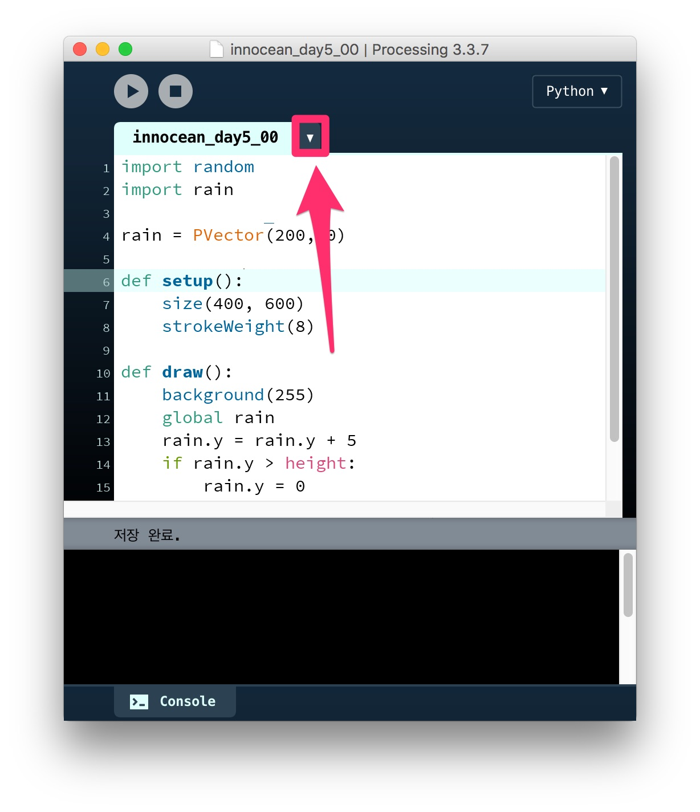
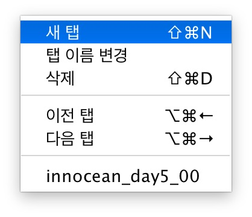
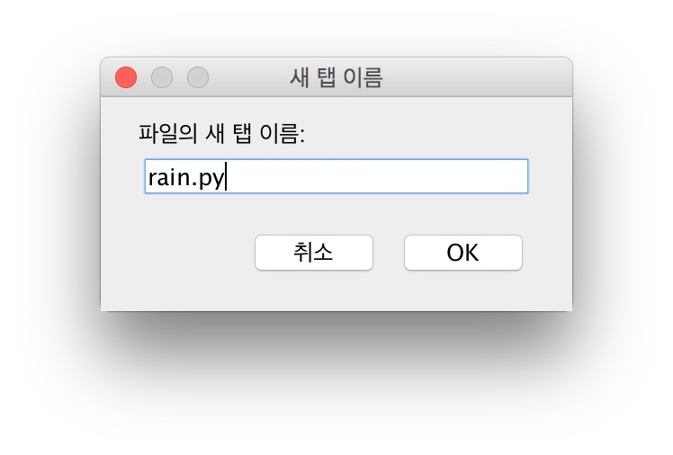

# [DAY 5] 클래스

## 창 크기 설정

```python
def setup():
    size(400, 600)
```

## 배경색 흰색 설정

```python
def setup():
    size(400, 600)
    background(255)
```

## 점으로 빗방울 그리기

```python
def setup():
    size(400, 600)
    background(255)
    point(200, 300)
```

### 점의 두께 바꾸기

```python
def setup():
    size(400, 600)
    background(255)
    strokeWeight(8)
    point(200, 300)
```

## 위에서 아래로 빗방울이 떨어지게 만들기

### 빗방울의 좌표를 저장할 변수 만들기

```python
x = 200
y = 0

def setup():
    size(400, 600)
    background(255)
    strokeWeight(8)

def draw():
    point(x, y)
```

위 코드를 실행하면 에러가 난다. 전역 변수와 지역 변수 때문이다.

```python
x = 200
y = 0
```

이 부분은 코드의 모든 부분에서 사용 가능한 전역 변수 부분이다.

```python
point(x, y)
```

여기에 `x`, `y`는 지역 변수로서 설정이 되어있다.

```python
x = 200
y = 0

def setup():
    size(400, 600)
    background(255)
    strokeWeight(8)

def draw():
      global x, y
    point(x, y)
```

위와 같이 `global x, y`처럼 입력해야 전역 변수를 사용할 수 있다.

### 빗방울의 좌표가 계속 아래로 내려가게 만들기

```python
x = 200
y = 0

def setup():
    size(400, 600)
    background(255)
    strokeWeight(8)

def draw():
    global x, y
    y = y + 1
    point(x, y)
```

그런데 위 코드를 실행하면 점이 내려가는 것이 아니라 선이 그려진다.

```python
x = 200
y = 0

def setup():
    size(400, 600)
    strokeWeight(8)

def draw():
    background(255)
    global x, y
    y = y + 1
    point(x, y)
```

위와 같이 매번 배경이 다시 그려지게 만들어야 한다.

```python
rain = PVector(200, 0)

def setup():
    size(400, 600)
    strokeWeight(8)

def draw():
    background(255)
    global rain
    rain.y = rain.y + 1
    point(rain.x, rain.y)
```

프로세싱의 `PVector`를 이용해 쉽게 좌표 정보를 관리할 수 있다.

```python
rain = PVector(200, 0)

def setup():
    size(400, 600)
    strokeWeight(8)

def draw():
    background(255)
    global rain
    rain.y = rain.y + 5
    point(rain.x, rain.y)
```

`rain.y = rain.y + 5`와 같이 빗방울의 속도를 바꿔본다.

## 빗방울이 아래로 내려가면 다시 위에서 내려가게 만들기

```python
rain = PVector(200, 0)

def setup():
    size(400, 600)
    strokeWeight(8)

def draw():
    background(255)
    global rain
    rain.y = rain.y + 5
    if rain.y > height:
        rain.y = 0
    point(rain.x, rain.y)
```

## 빗방울이 다시 떨어질때 x 좌표가 랜덤하게 바뀌도록 하기

```python
import random

rain = PVector(200, 0)

def setup():
    size(400, 600)
    strokeWeight(8)

def draw():
    background(255)
    global rain
    rain.y = rain.y + 5
    if rain.y > height:
        rain.y = 0
        x = random.randrange(0, width)
        rain.x = x
    point(rain.x, rain.y)
```

## 클래스 만들기



위와 같이 탭 아이콘을 클릭한다.



메뉴에서 `새 탭`을 선택한다.



파일 이름을 `rain.py`라고 설정한다.

```python
class Rain:
    def __init__(self, name):
        self.name = name
```

`rain.py`의 코드를 위와 같이 작성한다. 위 내용은 `Rain`이라는 클래스를 만든다는 뜻이다.

```python
from rain import *

rn = Rain('JH')
print(rn.name)

def setup():
    size(400, 600)
    strokeWeight(8)

def draw():
    background(255)
```

메인 코드를 위와 같이 수정한다.  `from rain import *`은 `rain`모듈에서 함수나 클래스를 모두 불러온다는 뜻이다.

## Rain 클래스에 좌표 정보 넣기

### rain.py

```python
class Rain:
    def __init__(self, x):
        self.pos = PVector(x, 0)
```

### 메인

```python
from rain import *
import random

rn = Rain(200)

def setup():
    size(400, 600)
    strokeWeight(8)

def draw():
    background(255)
    global rn
    rn.pos.y = rn.pos.y + 5
    if rn.pos.y > height:
        rn.pos.y = 0
        x = random.randrange(0, width)
        rn.pos.x = x
    point(rn.pos.x, rn.pos.y)
```

## Rain 클래스에 display 명령어 추가하기

### rain.py

```python
import random

class Rain:
    def __init__(self, x):
        self.pos = PVector(x, 0)

    def display(self):
        self.pos.y = self.pos.y + 5
        if self.pos.y > height:
            self.pos.y = 0
            x = random.randrange(0, width)
            self.pos.x = x
        point(self.pos.x, self.pos.y)
```

### 메인

```python
from rain import *

rn = Rain(200)

def setup():
    size(400, 600)
    strokeWeight(8)

def draw():
    background(255)
    global rn
    rn.display()
```

## 빗방울 여러개 만들기

### 메인

```python
from rain import *

rains = []

def setup():
    size(400, 600)
    strokeWeight(8)
    global rains
    rains.append(Rain(100))
    rains.append(Rain(200))
    rains.append(Rain(300))

def draw():
    background(255)
    global rains
    for r in rains:
        r.display()
```

## 빗방울의 시작 위치를 다르게 하기

### rain.py

```python
import random

class Rain:
    def __init__(self):
        x = random.randrange(0, width)
        y = random.randrange(0, height)
        self.pos = PVector(x, y)

    def display(self):
        self.pos.y = self.pos.y + 5
        if self.pos.y > height:
            self.pos.y = 0
            x = random.randrange(0, width)
            self.pos.x = x
        point(self.pos.x, self.pos.y)
```

### 메인

```python
from rain import *

rains = []

def setup():
    size(400, 600)
    strokeWeight(2)
    global rains
    for n in range(0, 100):
        rains.append(Rain())

def draw():
    background(255)
    global rains
    for r in rains:
        r.display()
```

## 빗방울의 속도를 다르게 하기

### rain.py

```python
import random

class Rain:
    def __init__(self):
        x = random.randrange(0, width)
        y = random.randrange(0, height)
        v = random.randrange(5, 11)
        self.pos = PVector(x, y)
        self.velocity = v

    def display(self):
        self.pos.y = self.pos.y + self.velocity
        if self.pos.y > height:
            self.pos.y = 0
            x = random.randrange(0, width)
            self.pos.x = x
        point(self.pos.x, self.pos.y)
```

### 메인

```python
from rain import *

rains = []

def setup():
    size(400, 600)
    strokeWeight(2)
    global rains
    for n in range(0, 100):
        rains.append(Rain())

def draw():
    background(255)
    global rains
    for r in rains:
        r.display()
```

## 빗방울의 굵기를 다르게 하기

### rain.py

```python
import random

class Rain:
    def __init__(self):
        x = random.randrange(0, width)
        y = random.randrange(0, height)
        v = random.randrange(5, 11)
        w = random.randrange(1, 5)
        self.pos = PVector(x, y)
        self.velocity = v
        self.weight = w

    def display(self):
        self.pos.y = self.pos.y + self.velocity
        if self.pos.y > height:
            self.pos.y = 0
            x = random.randrange(0, width)
            self.pos.x = x

        strokeWeight(self.weight)
        point(self.pos.x, self.pos.y)
```

### 메인

```python
from rain import *

rains = []

def setup():
    size(400, 600)
    global rains
    for n in range(0, 100):
        rains.append(Rain())

def draw():
    background(255)
    global rains
    for r in rains:
        r.display()
```

## 빗방울의 색을 다르게 하기

### rain.py

```python
import random

class Rain:
    def __init__(self):
        x = random.randrange(0, width)
        y = random.randrange(0, height)
        v = random.randrange(5, 11)
        w = random.randrange(1, 5)
        r = random.randrange(0, 10)
        g = random.randrange(0, 80)
        b = random.randrange(200, 256)
        a = random.randrange(50, 150)
        self.pos = PVector(x, y)
        self.velocity = v
        self.weight = w
        self.color = [r, g, b, a]

    def display(self):
        self.pos.y = self.pos.y + self.velocity
        if self.pos.y > height:
            self.pos.y = 0
            x = random.randrange(0, width)
            self.pos.x = x

        strokeWeight(self.weight)
        stroke(self.color[0], self.color[1], self.color[2], self.color[3])
        point(self.pos.x, self.pos.y)
```

### 메인

```python
from rain import *

rains = []

def setup():
    size(400, 600)
    global rains
    for n in range(0, 100):
        rains.append(Rain())

def draw():
    background(255)
    global rains
    for r in rains:
        r.display()
```
## Mission

빗방울 프로그램을 재미있게 수정해보기
