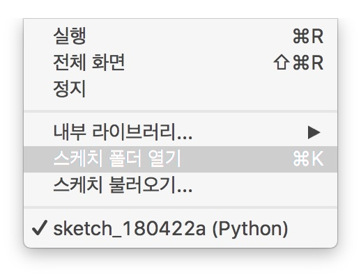

# [DAY 7] 웹 자료 받기

## 파일 읽기

```python
with open('helloworld.txt') as f:
    read_data = f.read()
    print(read_data)
```

스케치를 저장하고 아래와 같이 스케치 폴더를 연다.



`스케치` 메뉴에서 `스케치 폴더 열기`를 선택한다.

`helloworld.txt`라고 파일을 만들고 다음과 같이 내용을 입력한다.

```textile
Hello World!
Hello World!!
Hello World!!!
Hello World!!!!
Hello World!!!!!
```

`with`는 특정 변수가 동작하는 영역을 설정하는 것이다. 이 영역을 벗어나면 알아서 변수가 초기화된다.

`open`은 파일을 여는 명령어다.

파일을 열면 `f`라는 이름의 변수가 연 파일을 제어할 수 있게 된다.

이 변수에서 `read` 명령어를 사용하면 파일의 내용을 읽어 반환한다.


```python
with open('helloworld.txt') as f:
    for line in f:
        print(line)
```

위와 같이 실행시 파일의 내용을 한 줄씩 읽는다.


## 파일 쓰기

```python
with open('test.txt', 'w') as f:
    f.write('abc\nabc\nabc\nabc\n')
```

파일에 내용을 쓰기 위해서는 `open('test.txt', 'w')` 와 같이 입력해야한다. 만약 `test.txt` 파일이 없다면 파일을 만든다.

`write` 명령어를 사용하면 입력한 값을 파일에 적는다.

```python
with open('test.txt', 'a') as f:
    f.write('abc\nabc\nabc\nabc\n')
```

`open('test.txt', 'a')`와 같이 입력하면 내용을 기존 파일 맨 뒤에 덧 붙인다.
