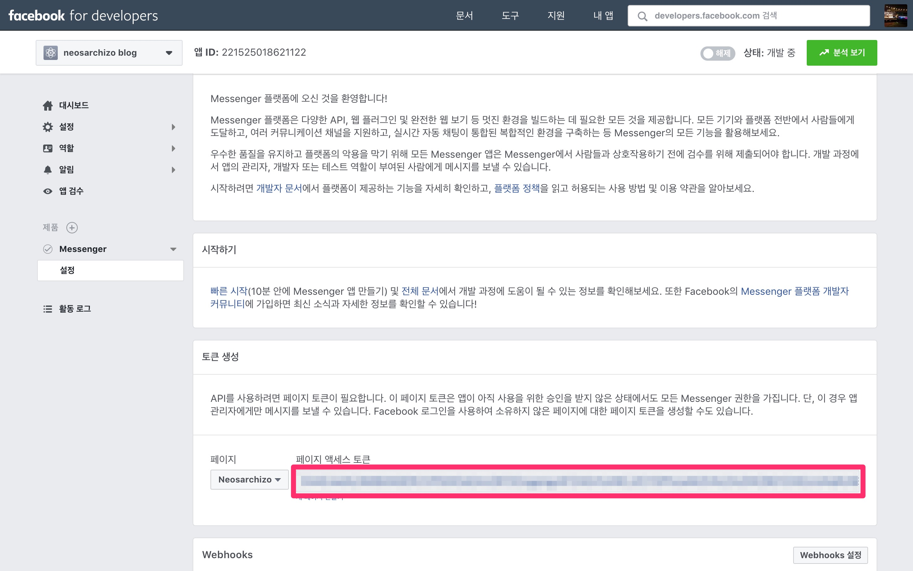

# [DAY 8] 페이스북 챗봇 만들기

## 파이썬 실행파일 만들기

다음과 같이 실행파일을 만들고 싶은 프로그램을 짠다. 파일명을 `helloworld.py`라고 저장한다.

```python
print('Hello World')
```

### 윈도우

터미널에서 아래와 같이 입력해 `py2exe`를 설치한다.

```bash
pip install py2exe
```

다음과 같이 입력해 `setup.py`를 작성한다.

```python
from distutils.core import setup
import py2exe

setup(console=['helloworld.py'])
```

터미널에서 다음과 같이 입력한다.

```
python setup.py py2exe
```

실행하면 `dist`폴더에 실행할 수 있는 `hello.exe`파일이 생긴다.

### 맥

터미널에서 아래와 같이 입력해 `py2app`을 설치한다.

```bash
pip install py2app
```

다음과 같이 입력해 `setup.py`를 작성한다.

```python
from setuptools import setup
setup(
    app=["helloworld.py"],
    setup_requires=["py2app"],
)
```

터미널에서 다음과 같이 입력한다.

```undefined
python setup.py py2app -A
```

실행하면 `dist`폴더에 실행할 수 있는 파일이 생긴다.

만약 터미널에서 실행하려면 다음과 같이 입력한다.

```
./dist/helloworld.app/Contents/MacOS/helloworld
```

## 소리 추가하기

메뉴에서 `스케치` - `내부 라이브러리...` - `라이브러리 추가하기...`선택한다.

`minim`을 검색해서 설치한다.

### 메인

```python
from player import *
from item import *

add_library('minim')

items = []

def setup():
    global minim, sound
    minim = Minim(this)
    sound = minim.loadFile("item.wav", 2048)
    global player
    player = Player()
    global items
    for n in range(0, 10):
        items.append(Item())
    size(600, 400)

def draw():
    background(255)
    global player
    if player.life == 10:
        textSize(50)
        textAlign(CENTER)
        text("Clear", width/2, height/2)
        return
    elif player.life == 0:
        textSize(50)
        textAlign(CENTER)
        text("Failed", width/2, height/2)
        return

    player.update()
    player.display()
    global sound
    global items
    for item in items:
        item.update(player, sound)
        item.display()
    drawLife()

def drawLife():
    fill(0)
    textSize(30)
    textAlign(LEFT)
    text("Life : " + str(player.life), 20, 40)
```

### player.py

```python
class Player:
    def __init__(self):
        self.pos = PVector(width/2, 350)
        self.life = 5

    def update(self):
        self.pos.x = mouseX

    def display(self):
        fill(255)
        ellipse(self.pos.x, self.pos.y, 50, 50)
```

### item.py

```python
import random

class Item:
    def __init__(self):        
        self.reset()

    def reset(self):
        x = random.randrange(0, width)
        y = random.randrange(50, height)
        v = random.randrange(5, 11)
        m = random.randrange(0, 2)
        self.pos = PVector(x, -y)
        self.velocity = v
        self.mode = m

    def update(self, player, sound):
        self.pos.y = self.pos.y + self.velocity

        if dist(player.pos.x, player.pos.y, self.pos.x, self.pos.y) < 37.5:
            sound.rewind()
            sound.play()
            if self.mode == 0:
                player.life = player.life + 1
                if player.life > 10:
                    player.life = 10
            elif self.mode == 1:
                player.life = player.life - 1
                if player.life < 0:
                    player.life = 0
            self.reset()
        elif self.pos.y > height:
            self.reset()

    def display(self):
        if self.mode == 0:
            fill(0, 0, 255)
        elif self.mode == 1:
            fill(255, 0, 0)

        ellipse(self.pos.x, self.pos.y, 25, 25)
```

## Yahoo Weather API

[https://developer.yahoo.com/weather/](https://developer.yahoo.com/weather/) 에 접속한다.

설정을 통해 서울의 날씨 정보를 얻을 수 있다.

```python
import urllib.request

with urllib.request.urlopen('https://query.yahooapis.com/v1/public/yql?q=select%20*%20from%20weather.forecast%20where%20woeid%20in%20(select%20woeid%20from%20geo.places(1)%20where%20text%3D%22seoul%2C%20ko%22)&format=json&env=store%3A%2F%2Fdatatables.org%2Falltableswithkeys') as response:
    text = response.read()
    print(text)
```

위와 같이 실행하면 날씨 정보에 대한 JSON을 받아서 출력한다.

```python
import urllib.request
import json

with urllib.request.urlopen('https://query.yahooapis.com/v1/public/yql?q=select%20*%20from%20weather.forecast%20where%20woeid%20in%20(select%20woeid%20from%20geo.places(1)%20where%20text%3D%22seoul%2C%20ko%22)&format=json&env=store%3A%2F%2Fdatatables.org%2Falltableswithkeys') as response:
    text = response.read()
    print(text)
    j = json.loads(text)
```

`json` 모듈을 추가해 파이썬에서 json을 제어할 수 있다.

## 페이스북 챗봇 만들기

터미널에서 다음을 입력해 `flask`와 `pymessenger`를 설치한다. 

```
pip install Flask==0.12.2
pip install pymessenger==0.0.7.0
```

다음과 같이 코드를 입력한다.

```python
from flask import Flask, request

app = Flask(__name__)
@app.route('/', methods=['GET', 'POST'])
def receive_message():
    return "Hello World!"

if __name__ == '__main__':
    app.run()
```

터미널에서 다음과 같이 입력하면 서버가 실행된다.

```
python app.py
```

[ngrok](https://ngrok.com/)에 가입한다.

`ngrok`을 설치한다.

터미널에서 아래와 같이 실행한다. 여기서 `AUTHTOKEN`은 자신의 `ngrok` 토큰이다.

```
./ngrok authtoken AUTHTOKEN
```

터미널에서 다음과 같이 입력하면 외부에서 로컬에 실행하는 서버에 접속할 수 있다. 여기서 `PORT`는 로컬에서 실행하는 포트 주소다.

```
./ngrok http PORT
```

코드를 다음과 같이 수정한다.

```python
import random
from flask import Flask, request
from pymessenger.bot import Bot

hi_words = ['안녕', '안녕하세요', '어? 왔니? 혼자야?', '오랜만이에요!']

app = Flask(__name__)
ACCESS_TOKEN = 'ACCESS_TOKEN'
VERIFY_TOKEN = 'VERIFY_TOKEN'
bot = Bot(ACCESS_TOKEN)

@app.route("/", methods=['GET', 'POST'])
def receive_message():
    if request.method == 'GET':
        token_sent = request.args.get("hub.verify_token")
        return verify_fb_token(token_sent)
    else:
        output = request.get_json()
        for event in output['entry']:
            messaging = event['messaging']
            for message in messaging:
                if message.get('message'):
                    recipient_id = message['sender']['id']
                    if message['message'].get('text'):
                        print('text message')
                        text = message['message']['text']
                        if '안녕' in text:
                            msg = random.choice(hi_words)
                            send_message(recipient_id, msg)
                    if message['message'].get('attachments'):
                        print('attachments')
    return "Message Processed"

def verify_fb_token(token_sent):
    if token_sent == VERIFY_TOKEN:
        return request.args.get("hub.challenge")
    return 'Invalid verification token'

def send_message(recipient_id, response):
    bot.send_text_message(recipient_id, response)
    return "success"

if __name__ == "__main__":
    app.run()
```

[developers.facebook.com](https://developers.facebook.com/)에 로그인 한다. 

`새 앱 추가`를 누른다.


`표시 이름`에 원하는 이름을 입력한다.


Messenger의 설정을 누른다.


페이지 선택에서 챗봇을 적용할 페이지를 선택한다.


페이지 액세스 토큰을 코드에 `ACCESS_TOKEN`에 입력한다.



[passwordsgenerator.net](http://passwordsgenerator.net/)에서 랜덤 문자를 생성해서 `VERIFY_TOKEN`에 입력한다.

ngrok과 함께 서버를 실행한다.

`Webhooks 설정`을 클릭한다.


다음과 같이 입력한다.


위에서 선택한 페이지를 선택한다.


`받아보기`를 클릭한다.


